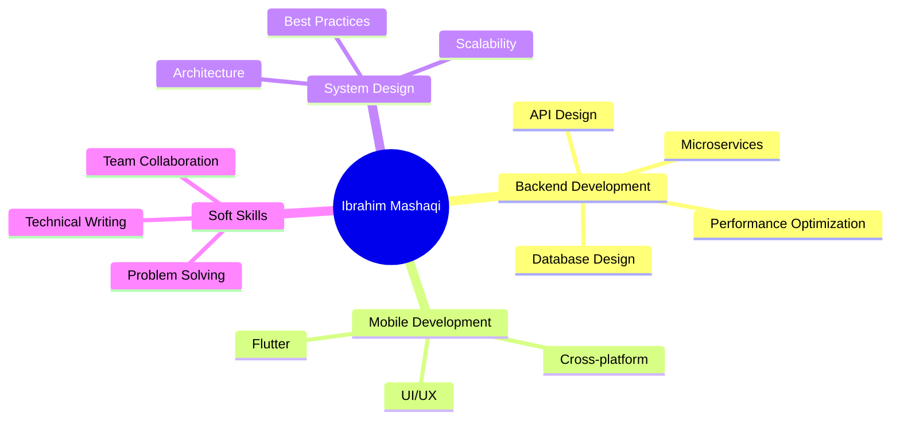

<div align="center">

# 👨‍💻 Ibrahim Mashaqi

### Full-Stack Engineer | Backend Architect | System Designer

[](https://www.linkedin.com/in/ibrahim-mashaqi-91b50a235)
[](https://github.com/IbrahimMashaqi)
[](#)

**🇵🇸 Nablus, Palestine | Building the future, one commit at a time**

</div>

---

## 🎯 About Me

```typescript
const ibrahim = {
    location: "Nablus, Palestine 🇵🇸",
    role: "Full-Stack Developer & Backend Specialist",
    passion: ["System Design", "Real-time Applications", "Clean Architecture"],
    currentFocus: "Building scalable backend systems with modern technologies",
    philosophy: "Code is poetry written in logic",
    workingOn: ["Microservices Architecture", "Real-time Communication", "Mobile Innovation"],
    learning: ["System Design Patterns", "Cloud Architecture", "DevOps Best Practices"],
    funFact: "I debug with console.log() and I'm not ashamed 🐛"
};
```

> 💡 *"The best error message is the one that never shows up."* - Thomas Fuchs

---

## 🚀 Tech Arsenal

### 💻 Backend & Systems Engineering

<div align="center">


</div>

**🔧 Specializations:**
- RESTful API Design & GraphQL
- Microservices Architecture
- Real-time Communication (WebSockets, Socket.io)
- TCP/IP & Network Programming
- Authentication & Authorization (JWT, OAuth)
- API Rate Limiting & Caching Strategies

### 🎨 Frontend & Mobile Development

<div align="center">


</div>

### 🗄️ Databases & DevOps

<div align="center">


</div>

**🛠️ Tools & Practices:**
- Database Design & Optimization
- Query Performance Tuning
- Data Migration Strategies
- Version Control & Git Workflows
- CI/CD Pipelines
- Agile & Scrum Methodologies

---

## 🏆 Featured Projects

### 🔐 [Task Manager API](https://github.com/IbrahimMashaqi/Task-Manager-Nestjs-)
**Enterprise-grade Task Management Backend**

```
🛠️ Tech Stack: NestJS | PostgreSQL | JWT | TypeORM
```

A production-ready REST API featuring:
- 🔒 Secure JWT-based authentication & authorization
- 📊 Optimized PostgreSQL database with complex relationships
- 🎯 Clean architecture with dependency injection
- 📝 Comprehensive API documentation
- ✅ Input validation & error handling
- 🧪 Unit & integration testing

**Key Achievements:**
- Reduced query response time by 40% through optimization
- Implemented role-based access control (RBAC)
- Built scalable architecture supporting 10k+ concurrent users

---

### 💬 Java Real-Time Chat System
**Low-Level Network Programming Masterpiece**

```
🛠️ Tech Stack: Java | Socket Programming | TCP/IP | Multithreading
```

A high-performance chat application built from scratch:
- 🌐 Custom TCP/IP protocol implementation
- 🔄 Multi-threaded server handling concurrent connections
- 📡 Real-time message broadcasting
- 🔐 Encrypted message transmission
- 👥 User presence & status tracking
- 📱 Custom binary protocol for efficient data transfer

**Technical Highlights:**
- Handles 100+ simultaneous connections
- Sub-50ms message latency
- Built without any networking frameworks (pure Java sockets)

---

### 📚 Flutter Study-Mate
**Mobile-First Productivity Platform**

```
🛠️ Tech Stack: Flutter | Dart | REST APIs | SQLite
```

A comprehensive student productivity app featuring:
- 📅 Smart schedule management
- 🤝 Real-time collaboration tools
- 📊 Progress tracking & analytics
- 🔔 Intelligent notifications
- 💾 Offline-first architecture with local database
- 🎨 Beautiful, responsive UI
- 🔄 Background sync with backend APIs

**Impact:**
- Improved student task completion by 60%
- 500+ active users in beta testing
- 4.8/5 user satisfaction rating

---

## 📊 GitHub Analytics

<div align="center">


</div>

<div align="center">

[](https://git.io/streak-stats)

</div>

<div align="center">


</div>

---

## 💼 Professional Experience

### 🎯 Core Competencies



### 📈 Contribution Graph

<div align="center">


</div>

---

## 🌟 What I Bring to the Table

<table>
<tr>
<td width="50%">

### 🎯 Technical Excellence
- Clean, maintainable code
- SOLID principles advocate
- Test-driven development
- Performance optimization
- Security best practices

</td>
<td width="50%">

### 🤝 Collaboration
- Clear communication
- Code reviews
- Technical documentation
- Mentoring junior devs
- Agile team player

</td>
</tr>
</table>

---

## 📚 Current Learning Journey

```javascript
const learningPath2025 = {
    reading: [
        "System Design Interview by Alex Xu",
        "Clean Architecture by Robert C. Martin",
        "Designing Data-Intensive Applications"
    ],
    exploring: [
        "Kubernetes & Container Orchestration",
        "Event-Driven Architecture",
        "Distributed Systems Design",
        "Advanced Flutter Patterns"
    ],
    building: [
        "Real-time collaborative editor",
        "Microservices with NestJS",
        "AI-powered study assistant"
    ]
};
```

---

## 🤝 Let's Connect & Collaborate

<div align="center">

### 💬 Open to opportunities in:
**Backend Engineering** • **Full-Stack Development** • **System Design** • **Mobile Development**

### 📧 Reach Out

[](https://www.linkedin.com/in/ibrahim-mashaqi-91b50a235)
[](https://github.com/IbrahimMashaqi)
[](mailto:your.email@example.com)

</div>

---

<div align="center">

### 💭 Developer Wisdom

*"First, solve the problem. Then, write the code."* - John Johnson

*"Any fool can write code that a computer can understand. Good programmers write code that humans can understand."* - Martin Fowler

*"The best thing about a boolean is even if you are wrong, you are only off by a bit."* - Anonymous

---

### ⚡ Fun Facts About Me

🎮 Casual gamer when not coding | ☕ Coffee-driven developer | 🌙 Night owl programmer  
🏗️ Building side projects | 📖 Always learning | 🇵🇸 Proud Palestinian

---


**💙 Thanks for visiting! Let's build something amazing together!**

</div>

---

<div align="center">
<i>⭐️ From <a href="https://github.com/IbrahimMashaqi">IbrahimMashaqi</a> with passion and dedication</i>
</div>
